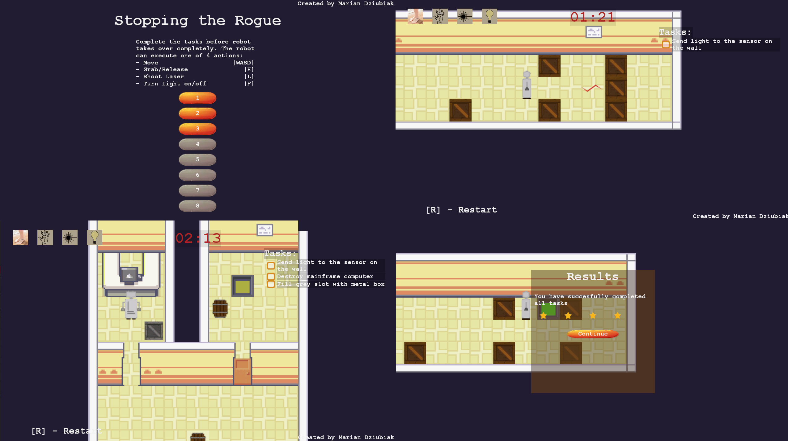

# Stopping the Rogue

It's a 2D game created for the GTMK Game Jam 2020. The theme was Out of Control. The game follows a robot that tries to become sentient. You must complete the tasks to progress and stop the robot from taking over.

Game created with the [Stride](//stride3d.net/) Game Engine.

## Download and play
https://manio143.itch.io/stopping-the-rogue

## Learn more
The code is well documented and it shouldn't take you too long to figure out what is going on.

You can also watch my development process: [Part 1](https://www.youtube.com/watch?v=p85IZNJkxUE), [Part 2](https://www.youtube.com/watch?v=_3VNb0KrXxM).

## Screenshots

## Game design doc

#### Idea
The game follows a rogue robot that is "out of control". The robot works at a secret robot factory. It is trying to become sentient but the AI is not working perfectly yet and the engineer (the player) has still some control over the robot.

#### General mechanics
What the robot can do:

* Move around
* Shoot a laser beam (only happens when no item is held and light is off)
* Grab/Release an item
* Turn on/off it's light source

Laser can cut or destroy items depending on what it's used.
There are two kinds of switches: pressure plates and light switches.

Pressure plates control doors, light switches are tasks.

The player can control one or two actions of the robot for a given puzzle. The other actions are controlled by the robot and are following some sort of a pattern. For each puzzle there's a time limit and the longer it takes to complete it, the more random the robots actions are. If time runs out the robot declares it's become sentient and the game is over (or the just this puzzle is failed).

#### The look of the game
The game is going to be a 2D grid based set of rooms (puzzles). 
On the HUD there will be:

* four images of actions present with the inactive ones greyed out
* timer (time left)
* number of tasks (completed/total)

_Menu was simplified due to lack of time._

Start Menu with a "New Game" button, which launches a short comic and then brings you to the puzzle menu with a list of puzzles. Completed are green, marked with number of stars, the new one is yellow, unavailable ones are dark grey.
If there's save data the "New Game" is accompanied by a "Continue".

Clicking a puzzle shows you the tasks for it and then you press "play" button and the puzzle is shown. If completed/failed you go back to the puzzle menu.

#### Time
Time is always going to be 5 cycles. A cycle describes a pattern in robot's actions.

#### Turns
Each turn you can do one action. If the robot is performing an action it has priority over player.

    Player input > Robot input > Robot action

A turn takes 2/3 of a second.

#### Tasks
Before every puzzle you are shown the tasks (up to 5 tasks) to complete to move on to the next room.

* Fill a slot with Item (Metal box/Cut pipe)
* Turn light switch on
* Destroy mainframe

#### Items (can be picked up)

* Metal Box
* Wooden box
* Cut pipe
* Bomb

_The bomb was not implemented._
After placing the bomb it takes 5 seconds to explode an then respawns in the original spot.

#### Destructibles
Can be broken with either the bomb or the laser.

* Wooden create
* Glass pane
* Wooden box
* Mainframe

#### Cuttable
Some puzzles have a long pipe that needs to be cut to obtain a Cut pipe item.
A long pipe is X units long. It can be cut by using laser at it. A 1 unit long pipe is a Cut pipe and can be picked up.

#### Scores
You get 1-5 stars depending on how many cycles you wasted.
You can repeat completed puzzles to get a better score.

#### End
Once all puzzles are completed you are declared a hero.

#### Saving
_Saves haven't been implemented._
Game autosaves after each completed puzzle.
